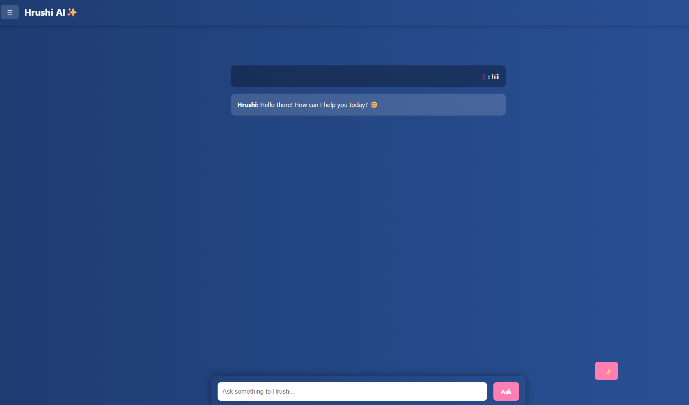

# 🚀 Hrushi AI

**Hrushi AI** is a full-stack AI-powered chatbot application built using the MERN stack. It helps users interact with a smart assistant that answers questions, provides guidance, and more—all in a clean, modern UI.

## 🖼️ preview 

## 📌 Features

- ✨ Chat interface with a smart AI assistant
- 🔒 Firebase authentication (Google sign-in + logout)
- 🌙 Light/Dark mode toggle
- 💬 Persistent chat history
- ⚡ Fast and responsive UI with React + Tailwind CSS
- 🌐 Fully deployed (Frontend: Vercel, Backend: Render)

---

## 🛠️ Tech Stack

**Frontend:**
- React
- Vite
- Tailwind CSS
- Firebase Auth
- Axios

**Backend:**
- Node.js
- Express
- OpenAI (or custom AI service)
- CORS, dotenv

**Deployment:**
- Frontend → Vercel
- Backend → Render
- Version Control → Git + GitHub

---

## 🧠 How It Works

1. User signs in with Google using Firebase Authentication.
2. After login, the user is taken to the chat screen.
3. The user can type questions, which are sent to the backend.
4. Backend processes and forwards the question to the AI API.
5. Response is shown in real-time in the frontend.
6. Users can start new chats or logout anytime.

---

## 🗂️ Folder Structure

